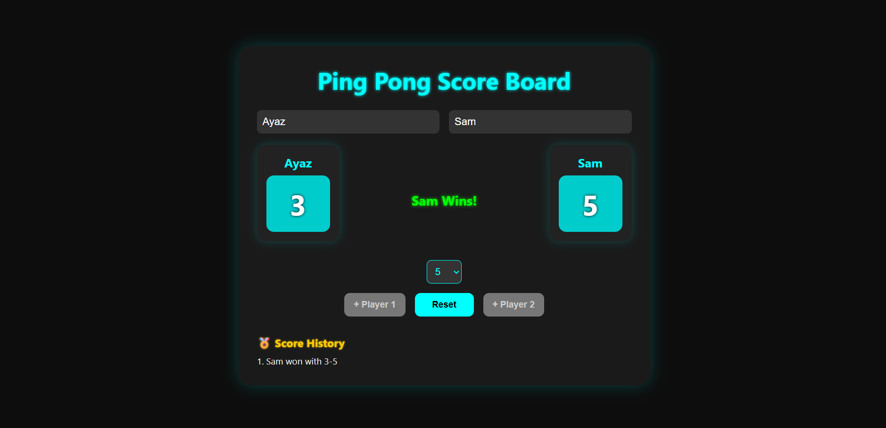

# 🏓 TT Score Board

A simple and interactive **Table Tennis (Ping Pong) Scoreboard** web app built using **HTML**, **CSS**, and **JavaScript**. It allows two players to increment scores, set a winning score, and track who wins.

## 🔧 Features

- 🎮 Track scores for **Player 1** and **Player 2**
- 🏆 Display the winner when the target score is reached
- 🔁 **Reset** button to restart the game anytime
- ⬆️ Customizable **Winning Score** (5, 10, 15)
- ✨ Clean and responsive UI design

## 📸 Preview

 

## 🚀 Live Demo

[👉 Try it Live](#) *(https://tt-score-board.netlify.app)*

## 📂 Project Structure

TT-ScoreBoard\
├── index.html # Main HTML file\
├── style.css # Stylesheet for layout and design\
├── script.js # JavaScript logic for game functionality\
└── README.md # Project documentation

## 🔤 How to Use

1. Clone this repo or download the ZIP.
2. Open `index.html` in your browser.
3. Use the `+ Player 1` and `+ Player 2` buttons to increase the score.
4. Choose the winning score from the dropdown.
5. When a player reaches the winning score, the game announces the winner.
6. Click `Reset` to restart the game.

## 🎨 Technologies Used

- HTML5
- CSS3 (Flexbox)
- Vanilla JavaScript (DOM manipulation)

## 📜 License

This open-source project is available under the [MIT License](LICENSE).

---

Feel free to fork the repo and enhance the scoreboard with your creative features!

| Key | Action                |
| --- | --------------------- |
| A   | Add point to Player 1 |
| L   | Add point to Player 2 |
| R   | Reset the game        |

